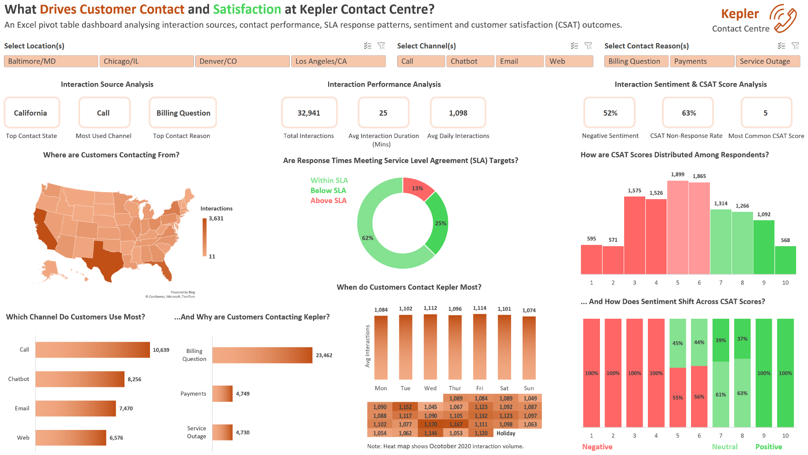

# Kepler Customer Contact Centre Dashboard

## Project Overview

This project is an Excel PivotTable dashboard analysing customer interactions for Kepler, a fictional contact centre organisation operating across four locations in the United States.

The dashboard explores interaction sources, channel usage, contact reasons, response time performance, interaction volume, sentiment and Customer Satisfaction (CSAT) outcomes for October 2020.

This project was created to demonstrate Excel dashboarding skills using PivotTables, PivotCharts, slicers, KPI cards and business-focused insight analysis.

## Business Question

**What drives customer contact and satisfaction at Kepler Contact Centre?**

The dashboard aims to answer:

* Where are customer interactions coming from?
* Which channels do customers use most?
* Why are customers contacting Kepler?
* Are response times meeting SLA targets?
* When does interaction volume peak?
* How are CSAT scores distributed among respondents?
* How does sentiment shift across CSAT scores?

## Excel Techniques Used

This project was built in Microsoft Excel using:

* PivotTables
* PivotCharts
* Slicers
* KPI cards
* Filled map visual
* Donut chart
* Bar charts
* 100% stacked column chart
* Calendar heat map
* Conditional formatting
* Custom dashboard formatting
* Linked cells and helper ranges
* Data grouping and categorisation
* Interactive filtering across dashboard sections

## Data Preparation and Assumptions

Several preparation steps and assumptions were made before building the dashboard:

* The dataset was treated as a contact centre interaction dataset for October 2020.
* The original duration field was interpreted as overall **interaction duration**, rather than only call duration, because the dataset includes multiple channels such as Call, Chatbot, Email and Web.
* Sentiment categories were grouped into three broader groups:

  * Very Negative and Negative → Negative
  * Neutral → Neutral
  * Positive and Very Positive → Positive
* Blank CSAT values were treated as non-responses and excluded from the CSAT score distribution.
* Weekday interaction volume was analysed using average daily interactions rather than total interactions, because some weekdays occurred more often than others during October 2020.
* The dataset appears to be generated for practice purposes, so some relationships between fields may be less varied than expected in real operational data.

## Dashboard Sections

### 1. Interaction Source Analysis

This section focuses on where interactions come from, which channels customers use and why customers contact Kepler.

It includes:

* Top contact state
* Most used channel
* Top contact reason
* Interaction volume by state
* Channel usage breakdown
* Contact reason breakdown

### 2. Interaction Performance Analysis

This section explores response time performance and interaction volume patterns.

It includes:

* Total interactions
* Average interaction duration
* Average daily interactions
* SLA response time breakdown
* Average interactions by weekday
* Calendar heat map for October 2020

### 3. Interaction Sentiment and CSAT Score Analysis

This section analyses customer perception and satisfaction outcomes.

It includes:

* Negative sentiment percentage
* CSAT non-response rate
* Most common CSAT score
* CSAT score distribution
* Sentiment split by CSAT score

## Dashboard Insights and Analysis

A full written explanation of the dashboard findings is available here:

[Dashboard Insights and Analysis](e2-insights-analysis.md)

The key findings include:

* 30% of Kepler’s interactions originated from California, Texas and Florida.
* Call was the most common starting channel at 32%, followed by Chatbot at 25%.
* Billing Question accounted for nearly 71% of all interactions, making it the main driver of contact volume.
* Response time performance appeared strong, with 87% of interactions meeting SLA targets.
* Despite strong SLA performance, 52% of interactions were classified as negative sentiment.
* 63% of interactions did not include a CSAT response.
* Among customers who responded to CSAT, 65% gave a score of 6 or below.
* Negative sentiment was only removed from CSAT score 7 onwards, suggesting that meeting SLA targets alone may not be enough to create a positive customer experience.

## Recommendations

Based on the dashboard analysis, Kepler should consider the following actions:

1. **Investigate Billing Question interactions**

   Billing Question accounts for the majority of contact volume. Kepler should investigate whether clearer billing information, improved self-service guidance or process improvements could reduce the number of billing-related interactions.

2. **Monitor negative sentiment despite strong SLA performance**

   Although most interactions meet SLA targets, customer sentiment remains negative. This suggests that fast response times alone may not be enough, and Kepler should investigate the quality and outcome of interactions.

3. **Improve CSAT response rates**

   A 63% CSAT non-response rate limits the amount of satisfaction feedback available. Kepler could review when and how CSAT surveys are sent to increase response rates.

4. **Review channel behaviour by contact reason**

   Some contact reasons appear strongly linked to specific channels. For example, Payments is linked entirely to Call, while Service Outage relies on digital channels. Kepler should explore whether these patterns reflect customer preference, process design or channel limitations.

5. **Use interaction volume for staffing planning**

   Daily interaction volume differences appear small, but the average interaction duration is 25 minutes. Even modest increases in daily volume could create meaningful staffing demand.

## Files Included

| File                                            | Description                                                            |
| ----------------------------------------------- | ---------------------------------------------------------------------- |
| `kepler-customer-contact-centre-dashboard.xlsx` | Main Excel workbook containing the dashboard, PivotTables and analysis |
| `e2-dashboard-preview.png`                      | Main dashboard preview image                                           |
| `e2-slicer-selection-1.png`                        | Example of dashboard interactivity using slicers                       |
| `e2-slicer-selection-2.png`                        | Additional slicer selection example                                    |
| `e2-insights-analysis.md`                       | Written dashboard insights and analysis                                |
| `README.md`                                     | Project documentation                                                  |

## Project Status

Completed Project 2 of 5

